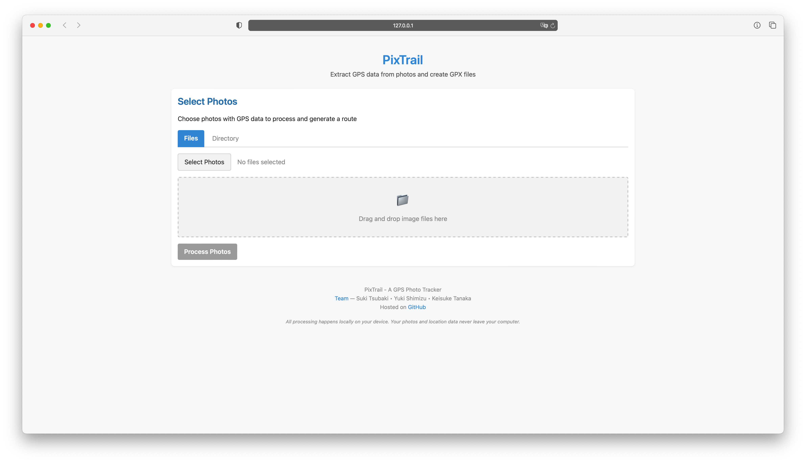

<!-- hello, world -->
<a href="https://github.com/sukitsubaki/pixTrail/releases"></a>
<a href="https://github.com/sukitsubaki/pixTrail/blob/main/LICENSE"></a>
<a href="https://github.com/sukitsubaki/pixTrail/blob/main/pyproject.toml"></a>
<a href="https://pypi.org/project/pixtrail/"></a>
<a href="https://github.com/sukitsubaki/pixTrail/tree/main/docs"></a>

# PixTrail

**PixTrail is a simple yet powerful tool that extracts the GPS information stored in your photos' EXIF metadata and converts it into standard GPX format that can be used in various mapping applications, allowing you to visualize and share your journeys.**

<div align="center">
  
</div>

## Quick Start

```bash
# Install with web interface
pip install pixtrail[web]

# Launch web interface
pixtrail -w

# Or process photos via command line
pixtrail -i /path/to/photos
```

## The Story Behind PixTrail

> As an avid photographer, I've always enjoyed using the Photos app on iOS and macOS to organize and relive my journeys. While these tools are great for managing photos, I found myself wishing for a way to reconstruct the routes I had taken during day trips or longer journeys based on the photos I captured along the way.
>
> I wanted to see the path I wandered through a city, the trails I hiked in the mountains, or the roads I traveled during a vacation - all visualized on a map using the GPS data already embedded in my photos. This desire to connect my photographic memories with their geographic context led to the creation of PixTrail.
> 
> *Suki Tsubaki*

## Features

### Core Functionality
- **GPS Data Extraction:** Extract GPS coordinates and timestamps from EXIF metadata in photos
- **Route Generation:** Create GPX files with waypoints and tracks for use in mapping applications
- **OpenStreetMap Integration:** Visualize routes directly on interactive maps

### Processing Capabilities
- **Hybrid Processing Approach:**
  - JPEG/TIFF files are processed directly in your browser for faster performance
  - RAW/PNG and other formats are processed on the server with full metadata extraction
- **Wide Format Support:**
  - Standard Formats: JPG, PNG, TIFF, BMP
  - Professional RAW Formats: CR2, NEF, ARW, ORF, RW2, PEF, SRW, DNG (Canon, Nikon, Sony, Olympus, Panasonic, Pentax, Samsung, digital negative)
- **Automated File Management:** Automatic cleanup of temporary files to save disk space

### User Interface
- **Multiple Access Methods:**
  - Command-line interface for quick scripting and batch operations
  - Web interface for browser-based visual operation
- **Advanced File Management:**
  - Directory selection with recursive processing support
  - Intuitive drag & drop interface for files and directories
  - Batch processing of multiple photo collections

### Advanced Visualization Features

- **Heat Map Visualization:** See where you spent the most time on your journey with color-coded intensity maps
- **Marker Clustering:** Group nearby photos for cleaner map displays with adjustable radius
- **Statistical Analysis:** View distance, elevation, speed, and time metrics for your journey
- **Interactive Charts:** Visualize elevation profiles and speed variations throughout your route

## Privacy

PixTrail processes all photo metadata locally on your device. No data is uploaded to any server, shared with third parties, or sent anywhere outside your computer. Your location data and photos remain completely private and under your control at all times.

When using the web interface:
- JPEG/TIFF files are processed entirely in your browser - only extracted GPS coordinates are sent to the local server
- RAW/PNG files are temporarily cached (local) during processing and automatically deleted afterward
- Only the generated GPX files are stored (local)

## Installation

### Basic Installation

```bash
pip install pixtrail
```

### Installation with Web Interface

```bash
# For bash, PowerShell, or Command Prompt
pip install pixtrail[web]

# For zsh (macOS default shell)
pip install "pixtrail[web]"
```

### Install from Source

```bash
git clone https://github.com/sukitsubaki/pixtrail.git
cd pixtrail
pip install -e .
```

## Usage

### Command Line

```bash
# Basic usage
pixtrail -i /path/to/photos

# Specify output file
pixtrail -i /path/to/photos -o /path/to/output.gpx

# Search recursively in subdirectories
pixtrail -i /path/to/photos -r

# Enable verbose output
pixtrail -i /path/to/photos -v

# Batch process multiple directories
pixtrail -b /path/to/photos1 /path/to/photos2 /path/to/photos3

# Batch process with a common output directory
pixtrail -b /path/to/photos1 /path/to/photos2 -d /path/to/gpx_output

# Start the web interface
pixtrail -w

# Start the web interface on a specific host and port
pixtrail -w --host 0.0.0.0 --port 8080

# Start the web interface without automatically opening a browser
pixtrail -w --no-browser
```

### Web Interface

The web interface provides a user-friendly way to upload photos, extract GPS data, visualize routes on a map, and download GPX files:

<div align="center">
  
</div>

1. Start the web interface:
   ```bash
   pixtrail -w
   ```

2. Your browser will automatically open to the PixTrail interface
3. Select photos using one of the following methods:
   - Click "Select Photos" to choose individual files
   - Click "Select Directory" to choose an entire folder
   - Drag and drop images directly into the interface
4. For directory processing, you can enable recursive subdirectory scanning
5. PixTrail will process the photos and display the route on a map
6. Use the map controls to:
   - Toggle the heatmap to visualize dwell time
   - Enable clustering for better visibility of dense photo areas
   - View statistics and charts for distance, elevation, and speed
7. Download the GPX file for use in other applications

### Python API

```python
from pixtrail.core import PixTrail

# Create a PixTrail object
pt = PixTrail()

# Process a directory of images
gps_data = pt.process_directory("/path/to/photos", recursive=True)

# Generate a GPX file
pt.generate_gpx("/path/to/output.gpx")

# Or do both in one step
pt.process_and_generate("/path/to/photos", "/path/to/output.gpx", recursive=True)
```

## Example Workflow

Here's a practical example of using PixTrail to document a hiking trip:

1. **Take photos** during your hike with a GPS-enabled camera or smartphone
2. **Transfer photos** to your computer into a folder (e.g., "Mountain_Hike")
3. **Process photos** using PixTrail:
   ```bash
   pixtrail -i ~/Photos/Mountain_Hike
   ```
4. **View the results**:
   - A GPX file named "Mountain_Hike.gpx" is created in the same directory
   - Or use the web interface for interactive visualization: `pixtrail -w`
5. **Use the GPX file**:
   - Import into Google Earth to see your route in 3D
   - Upload to hiking platforms like AllTrails or Strava
   - Share with friends or use in blog posts about your adventure

## Requirements

- Python 3.6 or newer
- exifread
- gpxpy
- Pillow
- Flask (for web interface)
- Chart.js (automatically included in web interface)

## Frequently Asked Questions

<details>
<summary><b>How accurate is the GPS data from photos?</b></summary>
The accuracy depends on your camera or smartphone's GPS capabilities. Most modern smartphones provide accuracy within 5-10 meters under good conditions. Professional cameras with built-in GPS may vary in accuracy. PixTrail extracts the data exactly as recorded in your photos' EXIF metadata.
</details>

<details>
<summary><b>Can I use photos without GPS data?</b></summary>
PixTrail requires photos with GPS coordinates in their EXIF metadata. Photos without this data will be skipped during processing. Most smartphones automatically embed GPS data when location services are enabled.
</details>

<details>
<summary><b>How does PixTrail handle large photo collections?</b></summary>
PixTrail is designed to efficiently process large collections. For very large sets (1000+ photos), the batch processing mode allows you to process multiple directories sequentially. The clustering feature in the web interface helps visualize dense collections by grouping nearby photos.
</details>

<details>
<summary><b>Can I customize the generated GPX files?</b></summary>
Basic customization is available through command-line options. For advanced customization, you can use the Python API to process the GPS data and create custom GPX files with specific attributes.
</details>

## Documentation

The PixTrail documentation is available in several formats:

- **Online Documentation**: Visit the [documentation website](https://sukitsubaki.github.io/pixTrail/)
- **Local Documentation**: Build the documentation locally by installing the development dependencies and running:
  ```bash
  # Install development dependencies
  pip install -e ".[dev]"
  
  # Build documentation
  python build_docs.py
  
  # OR serve locally with live reloading
  python build_docs.py --serve
  ```
- **Source Documentation**: Browse the documentation in the [docs](docs/) directory

## Future Roadmap

Here are some features we're planning to add in future releases:

- **Time-based Filtering**: Process only photos within specific time windows
- **Route Smoothing**: Algorithm to reduce GPS inaccuracies
- **Custom Map Styles**: Support for different map providers and styles
- **Video Support**: Extract GPS data from video files
- **Offline Map Functionality**: Preloadable maps for use without internet connection
- **Multilingual Support**: Internationalization of the user interface
- **Interactive Web Export**: Share routes as standalone HTML pages with embedded photos
- **Map Screenshot Export**: Save the current map view as an image file

## Contributing

Contributions and suggestions for additional features are welcome! Here's how you can help:

- **Bug Reports**: If you encounter any issues, please open an issue on GitHub with details about the problem, including steps to reproduce it.
- **Feature Requests**: Have an idea for a new feature? Feel free to create an issue describing your suggestion.
- **Code Contributions**: Want to contribute code? Fork the repository, make your changes, and submit a pull request.
- **Documentation**: Help improve the documentation by fixing errors or adding examples.

Please follow these guidelines when contributing:
- Follow the existing code style
- Add tests for new functionality
- Update documentation as needed
- Keep pull requests focused on a single change

### Development Setup

```bash
# Clone the repository
git clone https://github.com/sukitsubaki/pixtrail.git
cd pixtrail

# Create a virtual environment
python -m venv venv
source venv/bin/activate  # On Windows: venv\Scripts\activate

# Install development dependencies
pip install -e ".[dev,web]"

# Run tests
pytest
```

## The Team Behind PixTrail

PixTrail is developed and maintained by a [dedicated team](TEAM.md) of passionate individuals:

- **Suki Tsubaki** - *Founder & Lead Developer*  
  The creative mind behind PixTrail's conception, Suki architects the web interface design and develops the core Python functionality.

- **Yuki Shimizu** - *Documentation Lead*  
  Responsible for creating and maintaining PixTrail's comprehensive documentation, ensuring users can make the most of the tool.

- **Keisuke Tanaka** - *Quality Assurance & JavaScript Developer*  
  Oversees the project's quality standards and develops the JavaScript components that power the interactive features.

We're committed to continuously improving PixTrail to help you better visualize and share your journeys.

## License

- This project is licensed under the MIT License by <a href="https://github.com/sukitsubaki" target="_blank">Suki Tsubaki</a>
- The <a href="https://github.com/sukitsubaki/pixTrail/tree/main/docs" target="_blank">documentation</a> is licensed under CC BY-ND 4.0 by <a href="https://github.com/radanana" target="_blank">Yuki Shimizu</a>
- The <a href="https://github.com/sukitsubaki/pixTrail/tree/main/examples/example_photos" target="_blank">example photos</a> are licensed under CC BY 4.0 by <a href="https://anil-oeztas.de" target="_blank">Anil Öztas</a>
